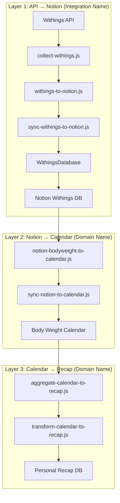
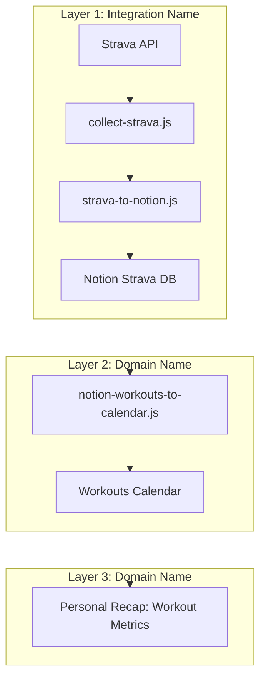

<!-- ff482423-d983-4e41-b77b-432de218754b b961ea34-1e05-4c13-be73-aa437d3d2575 -->

# Config-Driven Consistency & Naming Strategy

## Problem Statement

After reviewing your codebase, I've identified two main issues causing confusion:

1. **Inconsistent Config-Driven Architecture**: Some parts use the new config-driven approach (sweep sources, data sources), while others still have hardcoded logic (calendar-to-personal-recap workflow, calendar mappings scattered throughout)

2. **Unclear Naming Conventions**: Functions use inconsistent verbs (summarize/collect/fetch/get, transform/calculate/convert) making it hard to understand what each function does at a glance

## Three-Layer Data Flow Architecture

**Understanding the Abstraction Boundary**

The system uses a three-layer architecture where **domain abstraction happens at the Google Calendar layer**, not at the Notion layer. This is critical for understanding naming conventions:

### Layer 1: API → Notion (Integration Name Preserved)

External API data is collected and stored in Notion databases using **integration-specific names**:

```
Withings API → collect → transform → sync → Withings Database (Notion)
Strava API → collect → transform → sync → Strava Database (Notion)
Oura API → collect → transform → sync → Oura Database (Notion)
GitHub API → collect → transform → sync → GitHub Database (Notion)
Steam API → collect → transform → sync → Steam Database (Notion)
```

**Key Point**: Notion databases retain the **API/integration name** (Withings, Strava, Oura, etc.)

### Layer 2: Notion → Calendar (Domain Name Conversion)

When syncing from Notion to Google Calendar, data is **abstracted into domain categories**:

```
Withings Database (Notion) → transform → sync → Body Weight Calendar
Strava Database (Notion) → transform → sync → Workouts Calendar
Oura Database (Notion) → transform → sync → Sleep Calendar
GitHub Database (Notion) → transform → sync → PRs Calendar
Steam Database (Notion) → transform → sync → Games Calendar
```

**Key Point**: Google Calendar uses **domain/category names** (Body Weight, Workouts, Sleep, etc.)

### Layer 3: Calendar → Recap (Domain Name Maintained)

Calendar events are aggregated into Personal Recap using **domain names**:

```
Body Weight Calendar → aggregate → Personal Recap
Workouts Calendar → aggregate → Personal Recap
Sleep Calendar → aggregate → Personal Recap
PRs Calendar → aggregate → Personal Recap
Games Calendar → aggregate → Personal Recap
```

**Key Point**: Personal Recap metrics use **domain names**, not integration names

### Naming Convention Implications

This three-layer architecture dictates clear naming patterns:

| Layer       | Files/Functions                                | Naming Pattern           | Example                                                            |
| ----------- | ---------------------------------------------- | ------------------------ | ------------------------------------------------------------------ |
| **Layer 1** | Collectors, API transformers, Notion databases | Use **integration name** | `collect-withings.js`, `withings-to-notion.js`, `WithingsDatabase` |
| **Layer 2** | Calendar transformers, Calendar configs        | Use **domain name**      | `notion-bodyweight-to-calendar.js`, `BODY_WEIGHT_CALENDAR_ID`      |
| **Layer 3** | Recap workflows, aggregations                  | Use **domain name**      | `bodyWeight` metrics, `workout` aggregations                       |

### Config Structure

This maps to config organization:

```javascript
// Layer 1: Integration-specific (for API → Notion)
config.notion.databases.withings; // Notion database ID
config.notion.properties.withings; // Withings-specific properties

// Layer 2: Domain-specific (for Notion → Calendar)
config.calendar.calendars.bodyWeight; // Body Weight calendar ID
config.calendar.calendars.workouts; // Workouts calendar ID

// Layer 3: Domain-specific (for Calendar → Recap)
config.dataSources.bodyWeight.metrics; // Body weight metrics
config.dataSources.workouts.metrics; // Workout metrics
```

### Why This Matters

1. **Maintainability**: Can swap Withings for another body weight API without changing calendar/recap layers
2. **Clarity**: Developers immediately know which layer they're working in based on naming
3. **Extensibility**: Can support multiple sources for same domain (e.g., Oura + Apple Health → Sleep Calendar)
4. **Debugging**: Error messages clearly indicate which layer failed (integration vs domain logic)

### Quick Reference: What to Call Things Where

| Data Type       | Layer 1 (API→Notion) | Layer 2 (Notion→Calendar) | Layer 3 (Calendar→Recap) |
| --------------- | -------------------- | ------------------------- | ------------------------ |
| **Body Weight** | `withings`           | `withings` → `bodyWeight` | `bodyWeight`             |
| **Workouts**    | `strava`             | `strava` → `workouts`     | `workouts`               |
| **Sleep**       | `oura`               | `oura` → `sleep`          | `sleep`                  |
| **PRs**         | `github`             | `github` → `prs`          | `prs`                    |
| **Games**       | `steam`              | `steam` → `games`         | `games`                  |

**Examples**:

- ✅ `collect-withings.js` (Layer 1)
- ✅ `WithingsDatabase.js` (Layer 1)
- ✅ `notion-bodyweight-to-calendar.js` (Layer 2 - notice the transition!)
- ✅ `BODY_WEIGHT_CALENDAR_ID` (Layer 2)
- ✅ `bodyWeightMetrics` in recap (Layer 3)
- ❌ `BodyWeightDatabase.js` (Wrong! Should be `WithingsDatabase.js`)
- ❌ `collect-bodyweight.js` (Wrong! Should be `collect-withings.js`)

## Current State Analysis

### Config-Driven Inconsistencies

**Already Config-Driven (Good)**:

- [`src/config/sweep-sources.js`](src/config/sweep-sources.js) - Sweep CLI sources
- [`src/config/data-sources.js`](src/config/data-sources.js) - Data source metrics
- [`src/config/calendar-mappings.js`](src/config/calendar-mappings.js) - Calendar ID routing

**Still Hardcoded (Needs Fixing)**:

- [`src/workflows/calendar-to-personal-recap.js`](src/workflows/calendar-to-personal-recap.js) lines 44-200+ - Hardcoded calendar IDs and selection logic
- [`src/transformers/calendar-to-personal-recap.js`](src/transformers/calendar-to-personal-recap.js) lines 96-150+ - Hardcoded "shouldCalculate" logic for each calendar
- Multiple workflows manually checking `process.env` instead of using config

### Layer Naming Inconsistencies

**Violation of Three-Layer Architecture**:

The current codebase has Database classes using **domain names** when they should use **integration names** (Layer 1):

❌ **Current (Incorrect)**:

- `BodyWeightDatabase.js` - Should be `WithingsDatabase.js`
- `WorkoutDatabase.js` - Should be `StravaDatabase.js`
- `SleepDatabase.js` - Should be `OuraDatabase.js`
- `PRDatabase.js` - Should be `GitHubDatabase.js`

✅ **Already Correct**:

- `SteamDatabase.js` - Uses integration name
- `PersonalRecapDatabase.js` - Recap is domain-level

**Why This Matters**: Database classes are Layer 1 abstractions (wrapping Notion databases that use integration names like "Withings"). Using domain names creates confusion about which layer you're operating in.

### Naming Inconsistencies

**Verbs Used Inconsistently**:

- `summarize` - Used for: week summary, calendar summary, data aggregation
- `collect` - Used for: fetching API data, gathering metrics
- `fetch` - Used for: API calls, database queries
- `get` - Used for: simple retrievals, calculations
- `transform` - Used for: data formatting, calculations, conversions
- `calculate` - Used for: transformations, summaries

**File/Function Naming Issues**:

- `calendar-to-personal-recap.js` exists in both `workflows/` and `transformers/` (same name, different purposes)
- Functions like `summarizeWeek` could be more specific: `aggregateCalendarDataForWeek`
- `calculateWeekSummary` is actually transforming data, not just calculating

## Solution: Establish Clear Patterns

### Phase 1: Complete Calendar Config Migration

**Goal**: Make calendar-to-personal-recap workflow fully config-driven

#### Step 1.1: Extend Calendar Mappings Config

**File**: [`src/config/calendar-mappings.js`](src/config/calendar-mappings.js)

Add a new section for personal recap sources that defines:

- Which calendars feed into Personal Recap
- Their environment variable names
- Default selections
- Whether they're required or optional

```javascript
// NEW: Personal Recap Data Sources Configuration
const PERSONAL_RECAP_SOURCES = {
  sleep: {
    id: "sleep",
    displayName: "Sleep (Early Wakeup + Sleep In)",
    required: false,
    calendars: [
      {
        key: "normalWakeUp",
        envVar: "NORMAL_WAKE_UP_CALENDAR_ID",
        required: true,
      },
      { key: "sleepIn", envVar: "SLEEP_IN_CALENDAR_ID", required: true },
    ],
    fetchKey: "earlyWakeup", // Maps to calendar event key
    metrics: ["earlyWakeupDays", "sleepInDays", "totalSleepDays"],
  },
  drinkingDays: {
    id: "drinkingDays",
    displayName: "Drinking Days (Sober + Drinking)",
    required: false,
    calendars: [
      { key: "sober", envVar: "SOBER_CALENDAR_ID", required: true },
      { key: "drinking", envVar: "DRINKING_CALENDAR_ID", required: true },
    ],
    fetchKeys: ["sober", "drinking"],
    metrics: ["soberDays", "drinkingDays"],
  },
  workout: {
    id: "workout",
    displayName: "Workout",
    required: false,
    calendars: [
      { key: "workout", envVar: "WORKOUT_CALENDAR_ID", required: true },
    ],
    fetchKey: "workout",
    metrics: ["workoutDays", "workoutHours", "workoutSessions"],
  },
  // ... similar for all 13 sources
};

// Helper functions
function getAvailableRecapSources() {
  return Object.entries(PERSONAL_RECAP_SOURCES)
    .filter(([_, config]) => {
      // Check if all required env vars are set
      return config.calendars.every((cal) => process.env[cal.envVar]);
    })
    .map(([id, config]) => ({ id, ...config }));
}

function getCalendarIdsForSource(sourceId) {
  const source = PERSONAL_RECAP_SOURCES[sourceId];
  if (!source) return null;

  return source.calendars.reduce((acc, cal) => {
    acc[cal.key] = process.env[cal.envVar];
    return acc;
  }, {});
}
```

#### Step 1.2: Refactor Calendar Workflow

**File**: [`src/workflows/calendar-to-personal-recap.js`](src/workflows/calendar-to-personal-recap.js)

**Replace lines 44-200+** with config-driven logic:

```javascript
// OLD (lines 44-57): Hardcoded calendar IDs
const normalWakeUpCalendarId = config.calendar.calendars.normalWakeUp;
const sleepInCalendarId = config.calendar.calendars.sleepIn;
// ... 12 more lines

// NEW: Config-driven
const {
  getAvailableRecapSources,
  getCalendarIdsForSource,
} = require("../config/calendar-mappings");

const availableSources = getAvailableRecapSources();
```

**Replace lines 59-77** (calendar selection logic) with:

```javascript
// OLD: Hardcoded list
const calendarsToFetch =
  selectedCalendars.length > 0
    ? selectedCalendars
    : [
        ...(normalWakeUpCalendarId && sleepInCalendarId ? ["sleep"] : []),
        // ... 12 more lines
      ];

// NEW: Config-driven
const calendarsToFetch =
  selectedCalendars.length > 0
    ? selectedCalendars
    : availableSources.map((source) => source.id);
```

**Replace lines 80-200+** (fetch logic) with:

```javascript
// OLD: Repeated if-blocks for each calendar
if (calendarsToFetch.includes("sleep")) {
  if (!normalWakeUpCalendarId || !sleepInCalendarId) {
    throw new Error("Sleep calendars require...");
  }
  calendarFetches.push({ key: "earlyWakeup", promise: ... });
}
// ... repeated 12 times

// NEW: Config-driven loop
const calendarFetches = [];
for (const sourceId of calendarsToFetch) {
  const source = PERSONAL_RECAP_SOURCES[sourceId];
  const calendarIds = getCalendarIdsForSource(sourceId);

  // Validate required calendars
  const missingCalendars = source.calendars
    .filter(cal => cal.required && !calendarIds[cal.key])
    .map(cal => cal.envVar);

  if (missingCalendars.length > 0) {
    throw new Error(`${source.displayName} requires: ${missingCalendars.join(', ')}`);
  }

  // Add fetch promises based on source config
  if (Array.isArray(source.fetchKeys)) {
    // Multiple fetches (e.g., drinkingDays = sober + drinking)
    source.fetchKeys.forEach(fetchKey => {
      calendarFetches.push({
        key: fetchKey,
        promise: fetchCalendarSummary(calendarIds[fetchKey], startDate, endDate, accountType)
      });
    });
  } else {
    // Single fetch
    calendarFetches.push({
      key: source.fetchKey,
      promise: fetchCalendarSummary(calendarIds[source.fetchKey], startDate, endDate, accountType)
    });
  }
}
```

**Expected Savings**: ~120 lines eliminated, all calendar logic now config-driven

#### Step 1.3: Refactor Calendar Transformer

**File**: [`src/transformers/calendar-to-personal-recap.js`](src/transformers/calendar-to-personal-recap.js)

**Replace lines 96-150+** (shouldCalculate logic) with:

```javascript
// OLD: Hardcoded checks for each calendar
const shouldCalculate = (calendarKey) => {
  if (!selectedCalendars || selectedCalendars.length === 0) {
    return true;
  }
  // Special handling for sleep, drinkingDays, etc.
  if (
    selectedCalendars.includes("sleep") &&
    (calendarKey === "earlyWakeup" || calendarKey === "sleepIn")
  ) {
    return true;
  }
  // ... repeated logic for each source
};

// NEW: Config-driven
const { PERSONAL_RECAP_SOURCES } = require("../config/calendar-mappings");

const shouldCalculate = (calendarKey) => {
  if (!selectedCalendars || selectedCalendars.length === 0) {
    return true; // Calculate all
  }

  // Check if calendarKey is part of any selected source
  return selectedCalendars.some((sourceId) => {
    const source = PERSONAL_RECAP_SOURCES[sourceId];
    if (!source) return false;

    // Check if this calendar key matches the source's fetch key(s)
    if (Array.isArray(source.fetchKeys)) {
      return source.fetchKeys.includes(calendarKey);
    }
    return source.fetchKey === calendarKey;
  });
};
```

**Expected Savings**: ~50 lines eliminated

### Phase 2: Establish Naming Conventions

**Goal**: Create clear, consistent naming patterns that make file and function purposes immediately obvious, respecting the three-layer architecture

#### Naming Convention Rules

**Verb Usage Guidelines**:

| Verb | Use For | Example |

|------|---------|---------|

| `fetch` | External API calls (HTTP requests) | `fetchOuraSleepData()`, `fetchCalendarEvents()` |

| `query` | Database queries (Notion, internal) | `queryNotionDatabase()`, `querySleepRecords()` |

| `collect` | Gathering data from multiple sources | `collectCalendarMetrics()`, `collectWeeklyData()` |

| `aggregate` | Combining/summarizing multiple data points | `aggregateCalendarDataForWeek()` |

| `transform` | Converting data between formats | `transformOuraToNotion()`, `transformNotionToCalendar()` |

| `format` | Simple formatting (no logic) | `formatDateForDisplay()`, `formatRecordForLogging()` |

| `calculate` | Math operations only | `calculateTotalHours()`, `calculateWeekNumber()` |

| `build` | Constructing objects/structures | `buildNotionProperties()`, `buildMenuChoices()` |

| `sync` | Coordinating data between systems | `syncToNotion()`, `syncToCalendar()` |

| `process` | Multi-step operations | `processAppleNotes()` |

**File Naming Patterns**:

| Pattern | Structure | Example | Layer | Naming |

|---------|-----------|---------|-------|--------|

| **Layer 1: API → Notion** | | | | |
| Collectors | `collect-[integration].js` | `collect-withings.js`, `collect-strava.js` | 1 | Integration name |
| Transformers | `[integration]-to-notion.js` | `withings-to-notion.js`, `oura-to-notion.js` | 1 | Integration name |
| Workflows | `sync-[integration]-to-notion.js` | `sync-withings-to-notion.js` | 1 | Integration name |
| Databases | `[Integration]Database.js` | `WithingsDatabase.js` (NOT BodyWeightDatabase) | 1 | Integration name |

| **Layer 2: Notion → Calendar** | | | | |
| Transformers | `notion-[domain]-to-calendar.js` | `notion-bodyweight-to-calendar.js` | 2 | Domain name |
| Workflows | `sync-notion-[domain]-to-calendar.js` | `sync-notion-bodyweight-to-calendar.js` | 2 | Domain name |

| **Layer 3: Calendar → Recap** | | | | |
| Workflows | `aggregate-calendar-to-recap.js` | `aggregate-calendar-to-recap.js` | 3 | Domain name |
| Transformers | `transform-calendar-to-recap.js` | `transform-calendar-to-recap.js` | 3 | Domain name |

| **Cross-Layer** | | | | |
| Services | `[provider]-service.js` | `OuraService.js`, `GoogleCalendarService.js` | All | Provider name |
| Utils | `[purpose]-utils.js` | `date-utils.js`, `calendar-helpers.js` | All | Purpose-based |

#### Step 2.1: Rename Key Files

**Current inconsistencies to fix**:

1. **Duplicate names** - `calendar-to-personal-recap.js` in both workflows/ and transformers/

```
BEFORE:
src/workflows/calendar-to-personal-recap.js
src/transformers/calendar-to-personal-recap.js

AFTER:
src/workflows/aggregate-calendar-to-recap.js
src/transformers/transform-calendar-to-recap.js
```

2. **Function renames** for clarity:

```javascript
// In workflows/aggregate-calendar-to-recap.js
// OLD: summarizeWeek(weekNumber, year, options)
// NEW: aggregateCalendarDataForWeek(weekNumber, year, options)

// In transformers/transform-calendar-to-recap.js
// OLD: calculateWeekSummary(events, start, end, calendars, tasks)
// NEW: transformCalendarEventsToRecapMetrics(events, start, end, calendars, tasks)
```

3. **Collector file renames** for consistency (Layer 1 - Integration names):

```
BEFORE:
src/collectors/github.js
src/collectors/oura.js
src/collectors/steam.js
src/collectors/strava.js
src/collectors/withings.js
src/collectors/calendar-summary.js
src/collectors/tasks.js

AFTER (use integration names):
src/collectors/collect-github.js
src/collectors/collect-oura.js
src/collectors/collect-steam.js
src/collectors/collect-strava.js
src/collectors/collect-withings.js
src/collectors/collect-calendar.js
src/collectors/collect-tasks.js
```

**Note**: These are Layer 1 files, so they use **integration names** (withings, strava, oura, etc.)

4. **Database class renames** to match Layer 1 architecture:

```
CURRENT (Incorrect - using domain names):
src/databases/BodyWeightDatabase.js
src/databases/WorkoutDatabase.js
src/databases/SleepDatabase.js
src/databases/SteamDatabase.js
src/databases/PRDatabase.js

SHOULD BE (Layer 1 - integration names):
src/databases/WithingsDatabase.js
src/databases/StravaDatabase.js
src/databases/OuraDatabase.js
src/databases/SteamDatabase.js  ✅ (already correct)
src/databases/GitHubDatabase.js
```

**Rationale**: Database classes wrap Notion databases, which use integration names. They are Layer 1 abstractions.

**Impact**: This is a breaking change requiring updates to all files that import these classes. Consider doing this in a separate phase or keeping both (deprecated old name + new name) during migration.

5. **Update all imports** - Use search/replace to update imports throughout codebase

#### Step 2.2: Layer-Aware Variable Naming

**Within Functions and Code**: Variable names should reflect which layer they operate in:

```javascript
// ✅ LAYER 1: API → Notion (use integration names)
// File: collect-withings.js
const withingsMeasurements = await fetchWithingsData();
const withingsRecord = transformWithingsToNotion(measurement);
await withingsDatabase.upsertRecord(withingsRecord);

// ✅ LAYER 2: Notion → Calendar (transition from integration to domain)
// File: notion-bodyweight-to-calendar.js
const withingsRecords = await withingsDatabase.queryRecords(startDate, endDate);
const bodyWeightEvents = withingsRecords.map(transformToCalendarEvent);
await syncToBodyWeightCalendar(bodyWeightEvents);

// ✅ LAYER 3: Calendar → Recap (use domain names)
// File: aggregate-calendar-to-recap.js
const bodyWeightCalendarEvents = await fetchBodyWeightCalendar(start, end);
const bodyWeightMetrics = calculateBodyWeightMetrics(bodyWeightCalendarEvents);
await recapDatabase.updateMetrics({ bodyWeight: bodyWeightMetrics });
```

**Key Patterns**:

- Layer 1: `withingsData`, `stravaActivity`, `ouraSession`
- Layer 2 Input: `withingsRecords`, `stravaRecords` (reading from Notion)
- Layer 2 Output: `bodyWeightEvents`, `workoutEvents` (writing to Calendar)
- Layer 3: `bodyWeightMetrics`, `workoutMetrics`, `sleepMetrics`

#### Step 2.3: Add Descriptive File Headers

Add consistent JSDoc headers to all files explaining their purpose and layer:

````javascript
/**
 * @fileoverview [One-line description]
 * @layer [1|2|3] - Indicates which architecture layer this file operates in
 *
 * Purpose: [Detailed explanation]
 *
 * Responsibilities:
 * - [Main responsibility 1]
 * - [Main responsibility 2]
 *
 * Data Flow:
 * - Input: [What data comes in]
 * - Output: [What data goes out]
 * - Naming: [Integration name | Domain name]
 *
 * Example:
 * ```
 * const result = await mainFunction(params);
 * ```
 */
````

**Example for Layer 3 Workflow** [`src/workflows/aggregate-calendar-to-recap.js`](src/workflows/aggregate-calendar-to-recap.js):

````javascript
/**
 * @fileoverview Aggregate Calendar Data to Personal Recap Workflow
 * @layer 3 - Calendar → Recap (Domain names)
 *
 * Purpose: Orchestrates fetching calendar events from multiple Google Calendars
 * and aggregating them into weekly metrics for the Personal Recap database.
 *
 * Responsibilities:
 * - Fetch events from 13+ domain calendars (bodyWeight, workouts, sleep, etc.)
 * - Aggregate events into weekly metrics (days, hours, sessions)
 * - Update Personal Recap database with aggregated data
 *
 * Data Flow:
 * - Input: Week number, year, selected calendars (domain names)
 * - Fetches: Calendar events from Google Calendar API (Body Weight Calendar, Workouts Calendar, etc.)
 * - Transforms: Events → Weekly metrics (via transform-calendar-to-recap.js)
 * - Outputs: Personal Recap database update with domain-named metrics
 * - Naming: Uses DOMAIN names (bodyWeight, workouts, sleep) NOT integration names
 *
 * Example:
 * ```
 * await aggregateCalendarDataForWeek(48, 2025, {
 *   calendars: ['bodyWeight', 'workouts', 'sleep'] // Domain names!
 * });
 * ```
 */
````

**Example for Layer 1 Collector** [`src/collectors/collect-withings.js`](src/collectors/collect-withings.js):

````javascript
/**
 * @fileoverview Withings API Data Collector
 * @layer 1 - API → Notion (Integration name)
 *
 * Purpose: Fetch body weight and body composition data from Withings API
 * and prepare it for storage in the Withings Notion database.
 *
 * Responsibilities:
 * - Authenticate with Withings API
 * - Fetch measurement data for date range
 * - Handle pagination and rate limiting
 * - Return data in Withings-specific format
 *
 * Data Flow:
 * - Input: Date range, authentication tokens
 * - Fetches: Withings API measurements
 * - Outputs: Array of Withings measurement objects
 * - Naming: Uses INTEGRATION name (withings) NOT domain name (bodyWeight)
 *
 * Example:
 * ```
 * const withingsMeasurements = await collectWithingsData(startDate, endDate);
 * ```
 */
````

**Example for Layer 2 Transformer** [`src/transformers/notion-bodyweight-to-calendar.js`](src/transformers/notion-bodyweight-to-calendar.js):

````javascript
/**
 * @fileoverview Transform Withings Notion Records to Body Weight Calendar Events
 * @layer 2 - Notion → Calendar (Integration → Domain name transition)
 *
 * Purpose: Convert Withings database records from Notion into Google Calendar
 * events for the Body Weight calendar. This is where the abstraction from
 * integration-specific (Withings) to domain-generic (Body Weight) occurs.
 *
 * Responsibilities:
 * - Read records from WithingsDatabase (integration name)
 * - Transform to calendar event format
 * - Output events for Body Weight Calendar (domain name)
 *
 * Data Flow:
 * - Input: Withings Notion records (integration-specific properties)
 * - Transforms: Withings measurements → Calendar events
 * - Output: Body Weight Calendar events (domain-generic)
 * - Naming: Input uses 'withings', output uses 'bodyWeight'
 *
 * Example:
 * ```
 * const withingsRecords = await withingsDatabase.queryRecords(start, end);
 * const bodyWeightEvents = withingsRecords.map(transformToBodyWeightEvent);
 * await syncToBodyWeightCalendar(bodyWeightEvents);
 * ```
 */
````

### Phase 3: Create Visual Documentation

**Goal**: Make the system architecture and data flows crystal clear

#### Step 3.1: Create Data Flow Diagrams

**File**: `docs/data-flows.md` (NEW)

Create visual diagrams for the three-layer data architecture:

1. **Layer 1: External API → Notion** (Integration names)
2. **Layer 2: Notion → Google Calendar** (Domain name conversion)
3. **Layer 3: Google Calendar → Personal Recap** (Domain names)

Use Mermaid diagrams (renders in GitHub/Notion):

**Example: Body Weight Data Flow (All 3 Layers)**



**Example: Workout Data Flow**



#### Step 3.2: Create Function Reference Guide

**File**: `docs/function-reference.md` (NEW)

Organized by verb, list all functions with their purpose:

```markdown
## Fetch Functions (External API calls)

- `fetchOuraSleepData(startDate, endDate)` - Retrieves sleep sessions from Oura API
- `fetchStravaActivities(startDate, endDate)` - Retrieves workouts from Strava API
- ...

## Query Functions (Database operations)

- `querySleepRecords(startDate, endDate)` - Queries Notion Sleep database
- ...
```

#### Step 3.3: Update Architecture Documentation

**File**: [`ARCHITECTURE.md`](ARCHITECTURE.md)

Add new sections:

- "Naming Conventions" (reference the verb table)
- "File Organization Patterns" (reference the file naming table)
- "Common Confusions" (FAQ section addressing typical issues)

### Phase 4: Standardize Remaining Inconsistencies

#### Step 4.1: Audit and Fix Direct `process.env` Usage

Search for `process.env` usage outside of config files:

```bash
# Find all direct process.env usage
grep -r "process\.env\." src/ --exclude-dir=config
```

Move all environment variable access to config files:

```javascript
// BAD: Direct usage in workflow
const calendarId = process.env.WORKOUT_CALENDAR_ID;

// GOOD: Via config
const calendarId = config.calendar.calendars.workout;
```

#### Step 4.2: Consolidate Utility Files

**Problem**: `cli.js` is 680 lines with mixed concerns

**Solution**: Split into focused files:

```
src/utils/cli.js (680 lines)
  ↓
src/utils/cli/
  ├── index.js (exports all)
  ├── date-prompts.js (~150 lines) - Date/week selection prompts
  ├── display.js (~200 lines) - showSuccess, showError, showSummary
  ├── progress.js (~100 lines) - Progress indicators, spinners
  ├── formatters.js (~150 lines) - Format functions for display
  └── validators.js (~80 lines) - Input validation
```

#### Step 4.3: Standardize Workflow Return Values

Ensure all workflows return consistent result objects:

```javascript
// Standard workflow result format
{
  success: boolean,
  created: number,
  updated: number,
  skipped: number,
  errors: Array<{ item: any, error: string }>,
  metadata: {
    source: string,
    dateRange: { start: Date, end: Date },
    duration: number // milliseconds
  }
}
```

## Implementation Checklist

### Phase 1: Calendar Config (Priority: High)

- [ ] Extend calendar-mappings.js with PERSONAL_RECAP_SOURCES config
- [ ] Add helper functions: getAvailableRecapSources(), getCalendarIdsForSource()
- [ ] Refactor calendar-to-personal-recap workflow to use config (replace lines 44-200+)
- [ ] Refactor calendar-to-personal-recap transformer shouldCalculate logic
- [ ] Test calendar aggregation with different source selections

### Phase 2: Naming Conventions (Priority: High)

**Critical**: These renames enforce the three-layer architecture (Integration → Domain → Recap)

- [ ] **Document three-layer architecture** in ARCHITECTURE.md
- [ ] Rename workflow: calendar-to-personal-recap.js → aggregate-calendar-to-recap.js
- [ ] Rename transformer: calendar-to-personal-recap.js → transform-calendar-to-recap.js
- [ ] Rename collectors to use integration names: github.js → collect-github.js (×7 files)
- [ ] **Rename databases to use integration names (BREAKING CHANGE)**:
  - [ ] BodyWeightDatabase.js → WithingsDatabase.js
  - [ ] WorkoutDatabase.js → StravaDatabase.js
  - [ ] SleepDatabase.js → OuraDatabase.js
  - [ ] PRDatabase.js → GitHubDatabase.js
- [ ] Update all imports throughout codebase for renamed files
- [ ] Add JSDoc file headers indicating layer (1, 2, or 3) to all workflow files
- [ ] Add JSDoc file headers indicating layer to all transformer files
- [ ] Add JSDoc file headers indicating layer to all collector files
- [ ] Add JSDoc file headers indicating layer to all database files

### Phase 3: Documentation (Priority: Medium)

- [ ] Create docs/data-flows.md with Mermaid diagrams
- [ ] Create docs/function-reference.md with verb-organized function list
- [ ] Update ARCHITECTURE.md with naming conventions section
- [ ] Add "Common Confusions" FAQ section to docs

### Phase 4: Standardization (Priority: Medium)

- [ ] Audit and fix all direct process.env usage outside config files
- [ ] Split cli.js into focused utils/cli/ subdirectory
- [ ] Standardize all workflow return values to consistent format
- [ ] Add validation to ensure config consistency on startup

## Expected Impact

### Code Quality

- **Consistency**: 100% config-driven (no hardcoded calendar logic)
- **Clarity**: Function names immediately indicate their purpose
- **Maintainability**: Changes require only config updates, not code changes

### Developer Experience

- **Onboarding**: New developers understand system in 30 mins vs 3 hours
- **Debugging**: Clear names make it obvious where to look for issues
- **Confidence**: Standardized patterns reduce fear of breaking things

### Metrics

- **Lines Reduced**: ~170 lines eliminated from calendar workflow/transformer
- **Files Split**: 1 large file (680 lines) → 5 focused files (~150 lines each)
- **Config Coverage**: From ~60% config-driven to 95%+ config-driven

## Migration Strategy

**For each phase**:

1. Create feature branch
2. Implement changes in isolation
3. Run full test suite
4. Update 1-2 CLIs at a time
5. Merge when stable

**Rollback Plan**: Keep old files with `.deprecated` extension for 1 week before deletion

## Success Criteria

**Config-Driven**:

- [ ] Zero hardcoded calendar IDs in workflow/transformer files
- [ ] `process.env` only used in config files
- [ ] All calendar logic driven by calendar-mappings.js config

**Three-Layer Architecture**:

- [ ] All Layer 1 files (API→Notion) use integration names (withings, strava, oura, github, steam)
- [ ] All Layer 2 files (Notion→Calendar) use domain names (bodyWeight, workouts, sleep, prs, games)
- [ ] All Layer 3 files (Calendar→Recap) use domain names
- [ ] Database classes use integration names (WithingsDatabase, StravaDatabase, etc.)
- [ ] All file headers include @layer annotation

**Naming Conventions**:

- [ ] All functions follow verb convention guidelines
- [ ] File names follow layer-appropriate patterns
- [ ] Variable names reflect their layer (withingsData vs bodyWeightMetrics)
- [ ] Every file has a descriptive JSDoc header with layer information

**Documentation**:

- [ ] Three-layer architecture documented with diagrams
- [ ] All 3 data flows documented with Mermaid diagrams
- [ ] Function reference organized by layer and verb
- [ ] ARCHITECTURE.md updated with naming conventions and layer explanations

**Code Quality**:

- [ ] All utility files under 200 lines
- [ ] Standard workflow return format used consistently
- [ ] No confusion between integration names and domain names

### To-dos

**Phase 0: Document Three-Layer Architecture**

- [ ] Add three-layer architecture section to ARCHITECTURE.md
- [ ] Create layer transition diagram showing Integration → Domain conversion
- [ ] Document naming patterns for each layer

**Phase 1: Config-Driven Calendar Logic**

- [ ] Extend calendar-mappings.js with PERSONAL_RECAP_SOURCES config and helper functions
- [ ] Refactor calendar-to-personal-recap workflow to use config (lines 44-200+)
- [ ] Refactor calendar-to-personal-recap transformer shouldCalculate logic

**Phase 2: Layer-Aware File Renaming**

- [ ] Rename workflow: calendar-to-personal-recap.js → aggregate-calendar-to-recap.js
- [ ] Rename transformer: calendar-to-personal-recap.js → transform-calendar-to-recap.js
- [ ] Rename collector files to follow collect-[integration].js pattern (use integration names)
- [ ] Rename database classes to use integration names:
  - [ ] BodyWeightDatabase → WithingsDatabase
  - [ ] WorkoutDatabase → StravaDatabase
  - [ ] SleepDatabase → OuraDatabase
  - [ ] PRDatabase → GitHubDatabase
- [ ] Update all imports throughout codebase for renamed files

**Phase 2: Layer-Aware Documentation**

- [ ] Add @layer annotations to all file JSDoc headers
- [ ] Add layer-specific naming guidance to each header
- [ ] Document which names to use (integration vs domain) in each file
- [ ] Add descriptive JSDoc headers to all workflow, transformer, and collector files

**Phase 3: Visual Documentation**

- [ ] Create docs/data-flows.md with Mermaid diagrams for 3 layers
- [ ] Show integration→domain transition in diagrams
- [ ] Create docs/function-reference.md organized by layer and verb
- [ ] Add layer-aware examples to function reference

**Phase 4: Code Standardization**

- [ ] Audit and fix all direct process.env usage outside config files
- [ ] Split cli.js (680 lines) into focused utils/cli/ subdirectory files
- [ ] Standardize all workflow return values to consistent format
- [ ] Audit variable names to ensure layer-appropriate naming (withings vs bodyWeight)
